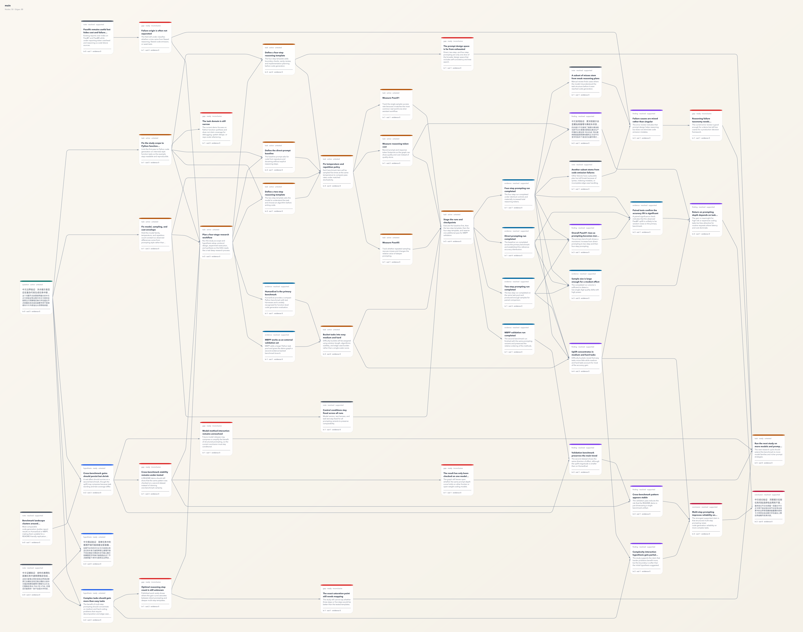

# Deep Research Skill

Current package version: `0.1.0`.

TypeScript CLI repository for running deep research as structured state instead of loose notes. It bundles three things: the `deep-research` command, the skill entrypoint in `SKILL.md`, and the reference manuals under `resources/references/`.

This README is the developer homepage. If you need the usage contract, decision boundary, or full CLI surface, read `SKILL.md` instead of expecting this file to pretend it is the whole manual.

## Start Here

- Read `SKILL.md` if you need to know when to use the skill and what the CLI contract is.
- Read this file if you want to build, test, link, or modify the repository.
- Read `resources/references/` if you need the research method, not just the tooling.
- Read `docs/` if you are looking for design records, validation notes, or architecture decisions.

## Quick Start

Requirements:

- Node.js 22 or newer.
- pnpm.

From source:

```bash
cd /path/to/deep-research-skill
pnpm install
pnpm build
pnpm dev -- --help
```

Run the main quality gate:

```bash
pnpm run check
```

Install the local CLI command:

```bash
pnpm run install:cli
```

Package: `deep-research-skill@0.1.0`.

Repository: `https://github.com/meomeo-dev/deep-research.git`.

That script installs dependencies, builds the project, and runs `npm link`, which exposes `deep-research` as a local command.

## Common Tasks

Show CLI help:

```bash
pnpm run cli:help
```

Run tests:

```bash
pnpm test
```

Run lint, typecheck, tests, and release-surface validation:

```bash
pnpm run check
```

Apply database migrations:

```bash
pnpm run db:migrate
```

Export the current DAG as PNG from the CLI:

```bash
deep-research graph_export --project /path/to/project --export-format png --output ./graph.png
```

Current runtime note:

- PNG export now uses skia-canvas as the default raster engine because this repository prioritizes export speed over minimum file size.

Rebuild and refresh the linked CLI after source changes:

```bash
pnpm run relink:cli
```

If you prefer `make`, use `make help` to see the matching shortcuts.

## Example DAG

If you want a concrete, non-trivial graph example, see `examples/readme-dag-50-demo/`. It contains a reproducible 50-node deep research DAG around a realistic question: when multi-step prompting is worth the extra token cost for code generation reliability.



## Repository Layout

Top level:

- `SKILL.md`: skill entrypoint, usage boundary, and full CLI contract.
- `src/`: source code for the CLI and runtime layers.
- `db/migrations/`: SQLite schema migrations.
- `resources/references/`: deeper method guides and long-form manuals.
- `docs/`: project design and validation records.
- `.deep-research/`: local research state generated by the CLI.

Source layout:

- `src/cli/`: command-line entrypoint and argument handling.
- `src/domain/`: research graph and core domain rules.
- `src/application/`: workflow orchestration and use cases.
- `src/infrastructure/`: persistence and environment-facing adapters.
- `src/shared/`: cross-cutting helpers.

## Documentation Map

Use the smallest document that answers the question:

- `README.md`: how to work on the repository.
- `SKILL.md`: how to use the skill correctly.
- `resources/references/01-scope-and-design.md`: how to frame the research problem.
- `resources/references/02-evidence-and-control.md`: how to collect and validate evidence.
- `resources/references/03-output-and-checklists.md`: how to synthesize and review outputs.

## Notes

- The persistence layer is SQLite-backed.
- The public binary name is `deep-research`.
- `src/index.ts` only re-exports the program builder; the real CLI entry lives under `src/cli/`.
- This README intentionally does not duplicate the full command catalog or research workflow contract from `SKILL.md`.

## License

MIT. See `LICENSE` for the full text.
